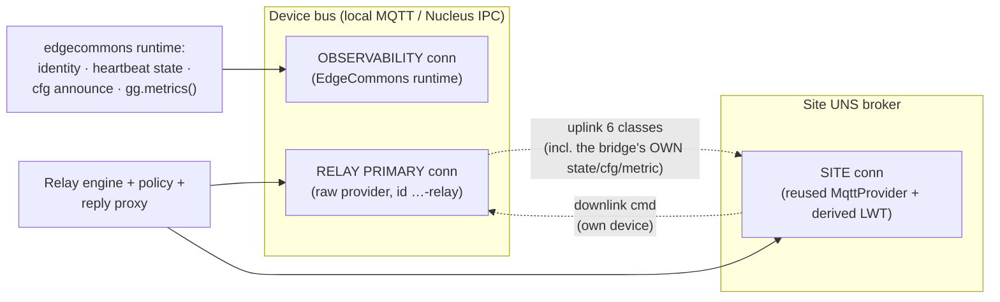
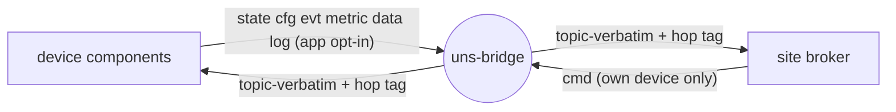

# Explanation — How the UNS bridge works, and why

This page is the mental model. For exact options see [reference/](reference/); for tasks, the
[how-to guides](how-to-guides.md); for worked configs, [sample-configurations.md](sample-configurations.md).

## The problem it solves

The [Unified Namespace](reference/messaging-interface.md) (UNS) gives every message a globally-meaningful
topic — `ecv1/{device}/{component}/{instance}/{class}[/channel]`. But *physically* each device has its own
bus: a local MQTT broker on a HOST/Docker device, the Nucleus IPC bus on a Greengrass core. Those buses do
not see each other. A site-wide consumer — a historian recording every device, an MES integration, the edge
console — would otherwise have to open a connection to every device's broker and know each one's address.

The `uns-bridge` makes the *logical* UNS a *real, single* bus. Deploy **one bridge per device bus**; each
subscribes its device's UNS traffic and republishes it, **topic-verbatim**, onto a shared **site broker**
under the device's own namespace. Now the historian connects to one bus and subscribes six wildcards to see
the whole plant. Commands flow the other way: the bridge pulls down commands the site addresses to *its*
device.

The design north star is **edge-first with an intermittent uplink**. The bridge must come up and keep
serving the device bus even while the WAN to the site is down; the site connection retries in the background
and reconnects transparently. Data lost during an outage is lost by design — durability is the streaming
subsystem's job, not the bus's — with one deliberate exception: events/alarms (`evt`).

## The three connections

A common first assumption is that a bridge is one process with two connections (device and site). It is
actually **three**, because the bridge is a proper edgecommons component that also needs to observe *itself*.

| Connection | Owner | Built from | Purpose |
|---|---|---|---|
| **OBSERVABILITY** (device bus) | the `EdgeCommons` runtime | the standard `messaging` section of the config file (which doubles as the `--transport MQTT` payload) | the bridge's own identity, logging init, the heartbeat `state` keepalive on `ecv1/{device}/uns-bridge/main/state`, the effective-(redacted-)config `cfg` announce, `gg.metrics()`, and the library-owned SIGTERM/Ctrl-C shutdown signal |
| **RELAY PRIMARY** (device bus) | the bridge | the same `messaging` section, with `-relay` appended to every client id | the raw byte relay, the reply proxy's device-side reply topics, and the reconnect rehydration broadcast |
| **SITE** | the bridge | the bridge's own `component.instances[]` `"site"` entry, by reusing the edgecommons core's public MQTT provider with a bridge-derived Last-Will | the uplink target and downlink source; carries the private Last-Will `UNREACHABLE` contract |

**Why two connections to the *same* device bus?** The relay must operate at the **raw provider level** —
byte-verbatim, with *no* reserved-class publish guard — because it forwards messages other components
authored (including publishes to reserved classes like `state`/`metric`). The `EdgeCommons` runtime
deliberately keeps its raw `MessagingProvider` private (its `MessagingService` always enforces the
reserved-class guard), so the relay cannot borrow the runtime's connection. The cost is one extra local TCP
client on the device broker — trivial on HOST — and the two clients must not share an MQTT id (a shared id
makes the broker evict them in a session-takeover loop), hence the `-relay` suffix.

The elegant consequence: because the bridge's own `state`/`cfg`/`metric` traffic goes out on the
OBSERVABILITY connection and *matches the relay's own uplink filters*, the bridge is relayed to the site
broker **by itself**. The site sees the bridge exactly as it sees any other component — no special-casing —
plus the one thing only the bridge sets: the private site-connection Last-Will.

## The relay matrix — what crosses, and which way

The relay is **topic-verbatim**: a forwarded message is republished to the *identical* topic string on the
other connection; the envelope travels untouched except for the hop tag. What crosses is a fixed matrix of
UNS classes.

- **Uplink (device → site)** relays the **six consumer classes** — `state`, `cfg`, `evt`, `metric`, `data`,
  `log` — the same six wildcards a fleet consumer subscribes. A seventh class, `app`, is **opt-in** (default
  off; off also means its filter is never even subscribed). `cmd` is **never** uplinked — there is no
  cross-device request/reply, so the only requests crossing the bridge originate on the site side.
- **Downlink (site → device)** relays `cmd` **only**, and only for **this bridge's own device** — the
  downlink filter is pinned to `ecv1/{device}/+/+/cmd/#`. A bridge must pull down only commands addressed to
  its device, which is also exactly the scope its site-broker ACL grants it.

That the uplink set and the downlink set are **disjoint** is not incidental — it is the *structural* loop
guard for raw (non-envelope) messages, which carry no hop tag to inspect. A `cmd` the bridge relays down
onto the device bus can never match an uplink filter, so a single bridge can never echo a message back to
where it came from, envelope or not.

Why re-check the class in the engine when the subscription filters already constrain what arrives? Because
the decision surface should be self-contained and testable without a broker, and because a misconfigured
broker-side ACL could deliver something unexpected. The engine is a **pure function** — topic + payload +
direction in, a `Forward(bytes)`/`Drop(reason)` verdict out, no IO, no clock — which is why the whole
routing/pinning/loop-protection surface is unit-tested exhaustively against fakes.

## Loop protection — the hop tag

The site broker is not a dead end: a message relayed up could, in a multi-site or misconfigured topology,
find its way back to a device bus and be relayed again. The bridge stamps every relayed **envelope** with a
reserved tag, `tags._relay` — a JSON array of hop ids, each `{device}/uns-bridge`. Before forwarding, it
applies three rules:

1. **Drop-if-self** — if the array already contains this bridge's own hop id, drop silently (own echo).
2. **Drop at `maxHops`** — if the array already holds `maxHops` ids (default **4**), drop. This is defense
   against a cycle among *distinct* bridges, where drop-if-self never fires on the first lap.
3. **Otherwise append** this bridge's id and forward, envelope otherwise byte-structurally identical.

Two subtleties worth internalizing. First, **raw messages carry no tags** and so cannot be hop-stamped — they
rely entirely on the class-disjointness structural guard above. Second, the `_` prefix on `_relay` is the
library's reserved-tag convention; a non-conforming relay that wrote a non-array `_relay` is tolerated by
normalizing it (the `maxHops` cap still bounds any residual cycle). Consumers ignore `_relay`, but it
doubles as a "which path did this message take" breadcrumb.

## Request/reply across the bridge — the correlation map

Fire-and-forget commands relay untouched. **Request/reply** breaks without help, because `header.reply_to`
names a topic on the *site* broker (typically an ephemeral `edgecommons/reply-<uuid>`), and a device-side
responder replying onto the *device* bus would shout into a room where the requester isn't standing.

The bridge proxies the reply path:

1. **Down** — a relayed `cmd` carrying `header.reply_to` gets a **bridge-minted** reply topic
   (`edgecommons/reply-<uuid>`, the core's standard prefix, so it is indistinguishable from any other reply
   topic and structurally exempt from the reserved-class guard) written into its header. The bridge
   **subscribes that topic on the device bus first**, then relays the rewritten command, and records
   `bridge topic → original site reply topic` in a TTL'd correlation map. Subscribing before publishing
   closes the race where a fast responder replies before the subscription is live.
2. **Up** — the first message on a bridge reply topic is relayed to the **original** site `reply_to`,
   verbatim except for two touches: the hop tag is appended ("a reply is a relay like any other") and
   `header.reply_to` is dropped (a reply carries none, and a device-bus topic would be meaningless at the
   site). The correlation entry is then removed and the bridge topic unsubscribed — **one-shot**,
   first-reply-wins.
3. **TTL & bound** — entries expire after `reply.ttlSecs` (default **60 s**), and the map is bounded by
   `reply.maxPending` (default **1024**), evicting the *oldest* on overflow so a stuck responder can't
   starve fresh traffic. Both an expiry and an eviction unsubscribe the bridge topic and count
   `relay_reply_expired`. A reply that arrives after its entry is gone is a **stray** — dropped and counted.

The TTL default is deliberately **2×** the framework's 30 s request-deadline default
(`messaging.requestTimeoutSeconds`): the bridge must never tear down a reply path before the requester's own
deadline has settled it. This makes them a **paired knob** — raise `requestTimeoutSeconds` and you must raise
`reply.ttlSecs` in step.

## Two disconnect stories, one buffer

When the site link drops, or a site publish fails (the two are treated identically — a failed publish *is* a
disconnect), the per-class **uplink policy** decides each message's fate:

- **Everything except `evt` drops** and is counted `dropped_disconnected`. This is the "live path is not
  durable" rule made concrete: telemetry lost during an outage is gone, because durability belongs to the
  streaming subsystem, not the bus.
- **`evt` buffers.** Events and alarms ride a bounded, **memory-only, drop-oldest** replay buffer
  (`bufferWhileDisconnected`, default **on**, **1000**). A WAN blip must not lose an alarm *raise* or
  *clear*. On reconnect a watcher task replays the buffered events to the site broker **strictly in order**
  (they are the already-hop-stamped forward bytes, so topic-verbatim and loop rules still hold); overflow
  while down evicts the oldest, counted `evt_buffer_dropped`. To preserve intra-`evt` ordering, a *live*
  `evt` that arrives while older ones are still queued **joins the queue** rather than overtaking them.

"Memory-only" is a deliberate scope call: it survives a WAN blip, not a bridge restart. Durable, restart-safe
event capture is, again, the streaming subsystem.

## Reconnect rehydration

Because the UNS is not retained (no MQTT retained messages), a consumer that connects *after* a device
announced its `state`/`cfg` would otherwise see nothing until the next natural re-announce. On the
**rising edge** of a site reconnect, the bridge publishes two notification-style broadcasts on the **device
bus** — `ecv1/{device}/_bcast/main/cmd/republish-state` and `…/republish-cfg` — *before* it replays the
`evt` buffer. The `_bcast` pseudo-component rides the `+` component position of the downlink filter, so every
device component re-announces its `state` keepalive and effective `cfg`, which then ride the uplink so the
site view rehydrates without retain.

Each device component answers by re-announcing its state keepalive and effective cfg. Answering is built into
the edgecommons library (the four-language device-side `RepublishListener`), on by default — components need no
wiring. A reconnecting bridge's rehydration completes automatically, without relying on broker retain.

## The bridge's own observability

Nothing about the bridge's health is bespoke. Its heartbeat publishes its `state` keepalive; its `cfg`
publisher announces its redacted effective config; and every **30 s** a task snapshots the relay counters and
emits them through `gg.metrics()` on the UNS `metric` class (`ecv1/{device}/uns-bridge/main/metric/<name>`).
All of it matches the uplink filters and is relayed by the bridge itself. Counters emit **interval deltas**
(so they sum correctly in CloudWatch/EMF); two gauges — `relay_pending_replies` and `site_connected` — emit
current values. See [reference/messaging-interface.md](reference/messaging-interface.md#metrics) for the full
table.

The site Last-Will is deliberately private to the bridge-console contract. At startup the bridge derives its
real state topic from the resolved runtime identity (`gg.uns().topic(State)`) and registers
`{"status":"UNREACHABLE"}` on that topic with QoS 1 on the site broker. There is no `lwt` knob to set; a
configured `component.instances[site].lwt` is rejected so a typo cannot silently break console reachability.

## Platforms: where a bridge runs

- **HOST** — the primary target. Device bus and site bus are both MQTT brokers; the bridge is a plain binary
  (`--platform HOST`, `--transport MQTT` synthesized internally). This is what the tutorial and the e2e test
  exercise.
- **KUBERNETES** — the *same binary* deployed as a **boundary bridge** between an on-prem device bus and an
  in-cluster aggregation broker. It must be **`replicas: 1` + `strategy: Recreate`** — exactly one bridge per
  device bus (two would double-deliver everything; the hop tag prevents loops, not duplicates). Note the
  asymmetry: there is **no** bridge *inside* a cluster — the in-cluster broker is itself the aggregation
  point; a bridge only appears at a boundary.
- **GREENGRASS** — on a Greengrass core the bridge runs in its **HOST/MQTT** shape against a device-local
  MQTT broker: it requires the default `standalone` feature, and the packaging `recipe.yaml` targets that
  shape (HOST-style config via `GG_CONFIG`). A **PRIMARY = Nucleus IPC** device bus (with the site half over
  MQTT) is not supported. (The **site broker's** own Greengrass deployment recipe exists under
  `deploy/site-broker/greengrass/` — but that runs the *broker*, not a bridge inside a core.)

## A note on security

The relay runs at the raw provider level with **no in-process publish guard** — by design (it must forward
other components' reserved-class publishes byte-verbatim). That means the **site broker's per-device ACL is
the security boundary**, not any code in the bridge: an ACL that lets each bridge publish only under its own
`ecv1/{device}/#` subtree (and read only its own `cmd`) is what actually contains a compromised or
misconfigured device. Deploy the bridge **only** against an ACL-enforcing (and, in production, mTLS) site
broker; an ACL-less site broker has no boundary at all. The `deploy/site-broker/` recipe set ships exactly
this — a per-device `acl.conf`, server/client certs, and the compose/k8s/Greengrass manifests to run the
broker as the bridge's paired half.

## What the bridge deliberately does *not* do

- It does not transform payloads, re-key topics, or filter by content — it is a relay, not an ETL step.
- It does not uplink `cmd` or support cross-device request/reply.
- It does not make the live path durable — that is the streaming subsystem.
- It does not run inside a Kubernetes cluster, and it does not run over Greengrass IPC as the primary device bus.
- It does not enforce the site security boundary in code — the site broker's ACL/mTLS does.
